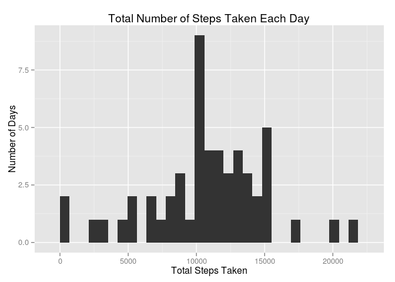
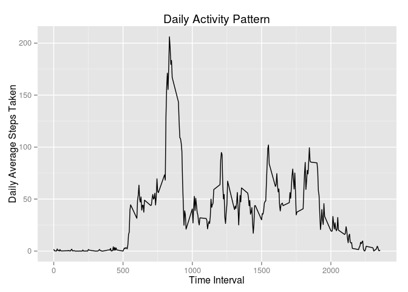
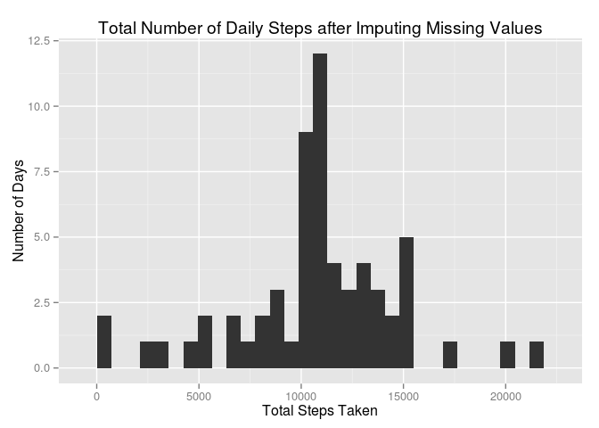
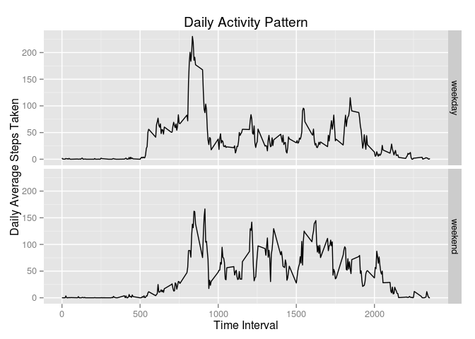

# Reproducible Research: Peer Assessment 1

## Preliminaries - setting up libraries


```r
library(dplyr)
```

```
## 
## Attaching package: 'dplyr'
## 
## The following object is masked from 'package:stats':
## 
##     filter
## 
## The following objects are masked from 'package:base':
## 
##     intersect, setdiff, setequal, union
```

```r
library(ggplot2)
```

## Loading and preprocessing the data

The data set has been placed into the subdirectory /data.
We will read in the data set as a csv and set it up for dplyr.


```r
stepsFile = 'data/activity.csv'
stepsDF = read.csv(file = stepsFile,
                  header = TRUE,
                  stringsAsFactors = FALSE)
plyrSteps = tbl_df(stepsDF)
summary(plyrSteps)
```

```
##      steps            date              interval     
##  Min.   :  0.00   Length:17568       Min.   :   0.0  
##  1st Qu.:  0.00   Class :character   1st Qu.: 588.8  
##  Median :  0.00   Mode  :character   Median :1177.5  
##  Mean   : 37.38                      Mean   :1177.5  
##  3rd Qu.: 12.00                      3rd Qu.:1766.2  
##  Max.   :806.00                      Max.   :2355.0  
##  NA's   :2304
```

## What is mean total number of steps taken per day?

This question asks us to ignore NAs, so we will create a DF summarizing total steps by date with NAs removed.


```r
dailyDF = plyrSteps %>%
        na.omit() %>%
        group_by(date) %>% # factor the dataset by date
        summarize(totalSteps = sum(steps)) # calculate total steps by day
```
A histogram will explore the summarization of that data.


```r
ggplot(dailyDF, aes(x=totalSteps)) +
        geom_histogram() +
        labs(title='Total Number of Steps Taken Each Day',
             x='Total Steps Taken', 
             y='Number of Days')
```

```
## stat_bin: binwidth defaulted to range/30. Use 'binwidth = x' to adjust this.
```

 


```r
options(scipen = 6, digits = 2)
avg = mean(dailyDF$totalSteps, na.rm=TRUE)
med = median(dailyDF$totalSteps, na.rm=TRUE)
```
The mean number of steps taken per day is 10766.19.  The median is 10765.

## What is the average daily activity pattern?

This question also asks us to ignore NAs, so we will create a DF summarizing mean steps by interval with NAs removed.


```r
intDF = plyrSteps %>%
        na.omit() %>%
        group_by(interval) %>% # factor the dataset by interval
        summarize(actPattern = mean(steps)) # calculate mean steps by interval
```

A line graph will explore the summarization of that data.


```r
ggplot(intDF, aes(x=interval, y=actPattern)) +
        geom_line() +
        labs(title='Daily Activity Pattern',
             y='Daily Average Steps Taken', 
             x='Time Interval')
```

 


```r
maxIntDF = intDF[intDF$actPattern==max(intDF$actPattern),]
maxInt = maxIntDF$interval
maxVal = maxIntDF$actPattern
```
The maximum interval is 835 with a value of 206.17.

## Imputing missing values


```r
naRows = sum(is.na(plyrSteps$steps))
```
There are 2304 with missing values.

We will fill in the missing values with the mean of that interval.  To do that we will merge the original plyr DF with the interval DF.  Whereever the step value is missing we will fill it in with the interval average.  Then we remove the interval average column.


```r
filledDF = merge(x=plyrSteps, y=intDF)

for (i in 1:nrow(filledDF)) {
        if (is.na(filledDF[i,2])) {
                filledDF[i,2]= filledDF[i,4]
        }
}

filledDF$actPattern = NULL
```

We will create a DF summarizing total steps by date with the filled in data.  


```r
filledDailyDF = filledDF %>%
        group_by(date) %>% # factor the dataset by date
        summarize(totalSteps = sum(steps)) # calculate total steps by day
```
A histogram will explore the summarization of the filled in data.


```r
ggplot(filledDailyDF, aes(x=totalSteps)) +
        geom_histogram() +
        labs(title='Total Number of Daily Steps after Imputing Missing Values',
             x='Total Steps Taken', 
             y='Number of Days')
```

```
## stat_bin: binwidth defaulted to range/30. Use 'binwidth = x' to adjust this.
```

 


```r
options(scipen = 6, digits = 2)
favg = mean(filledDailyDF$totalSteps)
fmed = median(filledDailyDF$totalSteps)
```
The mean number of steps taken per day is 10766.19.  The median is 10766.19.  Note: the mean is the same as the previous mean, but the median is now the same as the mean.  This probably happened because the default values imputed to the missing values were the mean of each respective interval.


## Are there differences in activity patterns between weekdays and weekends?

Take the filled in DF (filledDF), create a column with the weekday, create another column indicating if it is a weekday or weekend.  Make it a factor.


```r
filledDF$dayofweek = weekdays(as.Date(filledDF$date))
filledDF$day_type = ifelse(substr(filledDF$dayofweek,1,1)=='S', 'weekend', 'weekday')
filledDF$day_type = as.factor(filledDF$day_type)
filledDF$dayofweek = NULL
```

We will create a DF summarizing mean steps by interval and day_type so we can facet the data into weekday and weekend.


```r
intFillDF = filledDF %>%
        select(interval, day_type, steps) %>%
        group_by(interval, day_type) %>% # factor the dataset by interval, day_type
        summarize(actPattern = mean(steps)) # calculate mean steps by interval, day_type
```

Use ggplot2 facets to create panel


```r
ggplot(intFillDF, aes(x=interval, y=actPattern)) +
        geom_line() +
        facet_grid(day_type ~ .) +
        labs(title='Daily Activity Pattern',
             y='Daily Average Steps Taken', 
             x='Time Interval')
```

 
